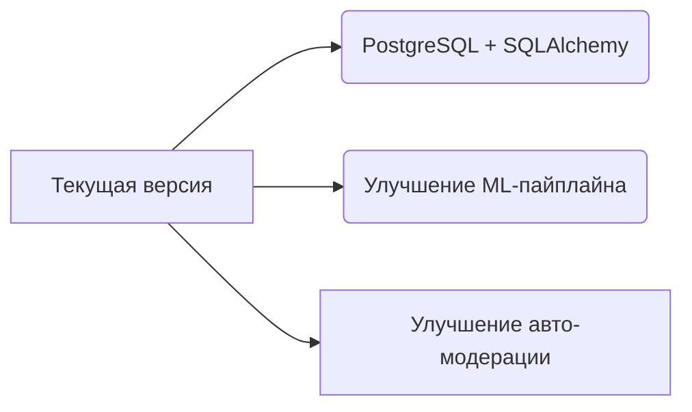

# BotStepikGuard 🛡️🤖

[](https://github.com/nihosprop/bot_stepik_guard.git)
[](https://www.python.org/)
[](https://docs.aiogram.dev/)
[](https://opensource.org/licenses/MIT)
[](https://redis.io/)
[](https://www.docker.com/)

**Умный страж комментариев** для платформы Stepik, автоматически выявляющий нежелательный контент и нарушения с использованием **ML-алгоритмов**.
## 🔍 Возможности

- **Мониторинг в реальном времени** новых комментариев на курсах Stepik
  - Возможность автоматического удаления комментариев, не прошедших фильтры 
    цензуры. 
- **ML - классификация токсичности** с использованием модели 
  [s-nlp/russian_toxicity_classifier](https://huggingface.co/s-nlp/russian_toxicity_classifier)
- **Продвинутая фильтрация** с использованием:
  - Регулярных выражений
  - Алгоритма Левенштейна
- **Гибкая система уведомлений** в Telegram:
  - Мгновенные алерты
  - Настройки включения\отключения уведомлений:
    1. Вкл\Откл уведомлений о не информативных комментариях.
    2. Вкл\Откл уведомлений из ветки решений.

## 🛠 Технологический стек

| Компонент          | Назначение                                                                      |
|--------------------|---------------------------------------------------------------------------------|
| **Python 3.13+**   | Основной язык разработки                                                        |
| **Aiogram**        | Telegram Bot Framework                                                          |
| **Redis**          | Кеширование и временные данные                                                  |
| **Docker**         | Контейнеризация                                                                 |
| **docker-compose** | Деплой                                                                          |
| **Stepik API**     | Интеграция с образовательной платформой                                         |
| **GitHub Actions** | После каждого пуша авто-сборка образа и отправка его в репозиторий на DockerHub |
|**russian_toxicity_classifier** | Модель классификации токсичности текста на русском |
## 🚀 Быстрый старт

```bash

# Клонирование репозитория
git clone https://github.com/nihosprop/bot_stepik_guard.git
```

### Структура на сервере
```
your_name_bot_dir
├── docker-compose.yml
├── .env
└── redis
    └── redis.conf

1. Прописать docker-compose.yml по аналогии docker-composePROD.yml,
заменив данные на свои.

2. Прописать .env по аналогии .env.PROD, заменив данные на свои

2. Прописать redis.conf под свои нужды..

! Задать пароль для Redis в .env и redis.conf
! Redis пароли должны совпадать в .env и redis.conf
```
### Деплой через docker-composePROD

```code
# Находясь в корне проекта(бота) исполнить:

docker compose up -d
```

### 📅 Планируемые функции
- **Кастомизация ML-фильтров**:
  - Возможность обучения модели на собственных данных
  - Регулировка порогов срабатывания
- **Улучшенная аналитика**:
  - Отслеживание подозрительной динамики и действий
- **Расширенная модерация**:
  - Автоматические шаблоны ответов
  - Разные уровни уведомлений
- **Подключение PostgreSQL + SQLAlchemy**

### 💡 Долгосрочные цели
